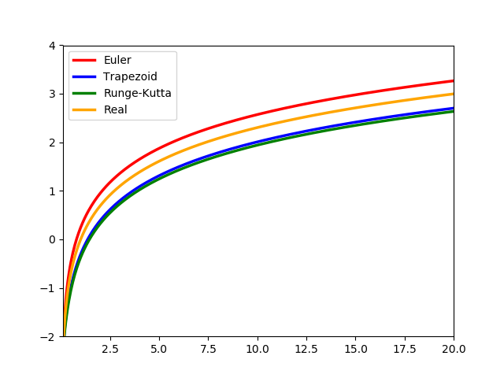
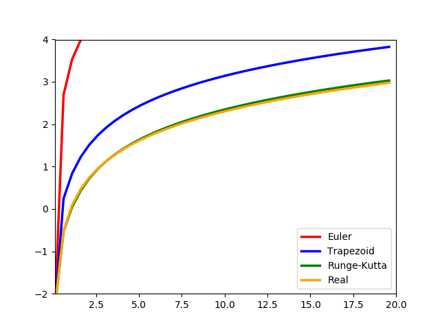

# <center>CS 184: Computer Graphics and Imaging</center>

## <center>Final Project: Smoothed Particle Hydrodynamics</center>

#### <center>Created by Zhiming Xu, Mingfang Zhang, [Cheng Chen](https://github.com/Julius-c)</center>

#### <center>SIDs: 3034485754, 3034485741, 3034488887</center>

##### <center>[Click here for project milestone](#milestone)</center>

##### <center>[Click here for project proposal](#proposal)</center>

### Abstract

We read the Smoothed Particle Hydrodynamics paper by $J. J. Monaghan$ and the Position Based Fluids paper by $Macklin$ and $Müller$, and finally build a fluid simulator based on the simplified algorithm which is basically the SPH method. This technique combines pressure, viscosity and gravity to simulate water. We firstly implement the basic mathematical and physical simulation model. Afterwards, we polish our shader programs to create fantastic lighting effects.

### Technical approach and implementation

#### Program Pipeline

We can show either 2D or 3D simulation by commenting out or defining a c++​ macro. In 3D Particle Fluid Simulation, at the very beginning, we set up a ground plane and four virtual surrounding walls with which the particles collide. Our approach then can be divided into two main parts — collision detection and system update, force application and time step integration.

We've learned from class the approach of collision detection and correction and it's time we put it into good use.

#### Smoothed-particle hydrodynamics

Fluid simulation is a common challenge in computer graphics, and one that illustrates the need for efficient physical models. While physically accurate simulations of fluid dynamics can be conducted by solving the **Navier-Stokes equations** exactly, this is computationally expensive in general, and as such is often not suitable for graphics applications, especially those that are meant to run in real time.


Therefore, an active area of research has been to search for more efficient discretizations of fluids. Particle-based simulations are attractive in this regard due to their relative simplicity. As a result, we built a fluid simulator based on the SPH method. 

SPH method is being increasingly used to model fluid motion, which has several benefits. First, SPH guarantees conservation of mass without extra computation since the particles themselves represent mass. Second, SPH computes pressure from weighted contributions of neighboring particles rather than by solving linear systems of equations.  For these reasons, it is possible to simulate fluid motion using SPH in real time.

Specifically, since we consider fluid as particles, there are several things we can ignore from the Navier-Stokes Equation, so that we get a simplified version like this:


And then we follow a computing pipeline:


Let's solve them one by one. (Assume that we already have a convenient data structure to store a particles' neighbors)

**Generally**, we want to compute some quantity A at an arbitrary position in space, we can use the equation:
$$
A(x)=\sum_jm_j/\rho_jA_jW(x-x_j,h)
$$
In which W is a smoothing kernel like this:


To calculate the **density**, attribute A is now $\rho$ :
$$
\rho_i=\sum_jm_jW_{ij}
$$
In which W is:


So we implement it like this:

```python
def compute_density(...):
    ...
    for each neigboring particles j:
      float index = nearestParticles.at(j)
      Vector3f x_j = get_position_i(state, index)
      float r = (x_i - x_j).abs()
      float W = compute_kernel(Poly6, r)
      density += MASS * W
  return density
```

Then we can calculate **pressure** from density:
$$
p_i=k(\rho_i-\rho_0)
$$
And the **force of pressure** would be:
$$
f^{pressure}=-\nabla p
$$
Since pressure force acts along vector between particles, we use the formula of attribute A like this:
$$
f^{pressure}=-\sum_jm_j/\rho_j*(p_i+p_j)/2\nabla W_{ij}
$$
In which W is:


So we implement it like this:

```python
def compute_pressure(...)
	for each neighboring particles j:
    	float density_j = particleDensity.at(j)
    	Vector3f r_ij = x_i - x_j
    	float q_ij = r_ij.abs() / H_KERNEL
    	float numerator1 = density_i + density_j - 2 * REST_DENSITY
    	float numerator2 = pow((1 - q_ij), 2)
    	force += MASS * numerator1 * numerator2 * r_ij / (density_j * q_ij)
  force = force * K_GAS_CONSTANT / (c_pi * pow(H_KERNEL, 4))
  return force;
```

Then we calculate the **viscosity** using the formula of A and since once again we need to make forces symmetric, we have:
$$
f_i^{viscosity}=\mu \sum_jm_j/\rho_j*(u_j-u_i)\nabla^2W_{ij}
$$
In which W is:


So we implement it like this:

```python
def compute_viscocity(...):
    for each neighboring particles j:
        force += MASS * (v_i - v_j) * (1 - q_ij) / density_j
    force = force * 40 * MU / (c_pi * pow(H_KERNEL, 4))
    return force
```

And finally we apply **gravity**:
$$
f_i^{gravity}=\rho_ig
$$
Now we can get the **acceleration** used for time integration:
$$
a_i=(f_i^{pressure}+f_i^{viscosity}+f_i^{gravity})/\rho_i
$$

#### Numerical integration

After calculating forces by the methods stated above, we need to apply them on the particles we have. Therefore, we use numerical integration to compute particles' displacements under the force $\vec{f}$ and thus their next states. We implement three integration methods in our project: explicit Euler, trapezoidal, and Runge-Kutta method (4th order). The ideas behind them are listed as follows. In this part, for simplicity, we do not distinguish force $\vec{f}$ and acceleration $\vec{a}$.

- Explicit Euler

  Given a state $\vec{X}(t)$ and force $\vec{f}(\vec{X}, t)$ at time $t$, and time interval $\Delta h$, we update the new state to $\vec{X}(t+\Delta t)=\vec{X}(t)+\Delta t\vec{f}(\vec{X}, t)$, which is just the Newton's second law using current state's acceleration as the acceleration over time interval $\Delta t$. This is very simple and tend to be unstable and diverge for more complicated particle system.

- Trapezoid rule

  In this method, we use two slopes to estimate the true integration over time. Specifically, after we get the force $\vec{f}(\vec{X}, t)$ at this time, we first apply Euler method on it to obtain the next state $\vec{X'}(t+\Delta t)$. But we do not use it directly as result, but compute force $\vec{f}(\vec{X'}(t+\Delta t), t+\Delta t)$. Then use the average of these two forces as the estimation of the force applied on our particles during time interval $\Delta t$ from $t$. Hence, the average acceleration is: $$\bar{\vec{f}}=\cfrac{1}{2}\left(\vec{f}(\vec{X}, t)+\vec{f}(\vec{X'}(t+\Delta t)) \right)$$, and the new state is updated to $$\vec{X}(t+\Delta t)=\vec{X}+\Delta t\bar{\vec{f}}$$.

- Runge-Kutta method (4th order)

  This method is more accurate and stable since it uses three slopes four times to estimate integration, once at the beginning and end of the time interval, twice in the middle. Concretely, given the force $\vec{f_1}=\vec{f}(t)$ on state $\vec{X}(t)$, it first uses forward Euler on half of the interval $t/2$ to obtain an intermedium state $\vec{X'}(t+\Delta t/2)$, and the force acting on it, $\vec{f_2}=\vec{f}\left(\vec{X'}(t+\Delta t/2), t+\Delta t/2\right)$. The apply $\vec{f_2}$ on the initial state for half the time interval to obtain another intermedium state $\vec{X''}(t+\Delta t/2)$ and force acting on it, $\vec{f_3}=\vec{f}\left(\vec{X''}(t+\Delta t/2), t+\Delta t/2\right)$. In the end, apply $\vec{f_3}$ on the whole time interval to obtain a rough estimation of next state $\vec{X'}(t+\Delta t)$ and the force acting on it, $\vec{f_4}=\vec{f}(\vec{X'}(t+\Delta t), t+\Delta t)$. In the end, we do a weighted sum of these factors to give the truly estimation of the integration and thus the next state $\vec{X}(t+\Delta t)$, i.e., 
  $$
  \vec{X}(t+\Delta t)=\vec{X}(t)+\cfrac{h}{6}\left(\vec{f_1}+2\vec{f_2}+2\vec{f_3}+\vec{f_4} \right).
  $$

A simple illustration is shown below. We use the three different methods to estimate $\ln(x)$ from $0.1$. The interval is set to $.05$ and $.5$, respectively. It is obvious that with a large integration interval, the error tends to be more enormous and accumulates over time. Note that for Euler method, the curve begin to diverge from true function shortly after starting, and the error grow larger and larger when interval is $0.5$, far less stable than trapezoid and RK4.





### Problems encountered

Throughout the course of our implementation journey, we encountered a couple of different technical problems.

To begin with, a bug in collision correction part leads to our particles' leaking out of the ground plane and bounding walls. (一个对应视频)

After navigating through according code block, we locate our calculation bug and successfully address this issue.

The next issue is about 

### Lessons learned

One of the critical lesson we've learned is to walk through several academic research paper and adjust the formulas and algorithm pseudo codes into mathematical and physical simulation model fitting our project code structure. Another lesson is that the basic infrastructure is very important. Lack of GPU and parallelization techniques have limited our computational power and we have to record our result video by the help of CPU. Additionally, the papers we've read enhanced us a lot about the theory behind fluid dynamics and particle simulation. Finally, together with teammates to tackle obstacles such as git version control, mysterious coding bugs is quite interesting and challenging.

### Results

Below is a demonstration of our results with xxx shading:


##### <center>[Click here for final slides]()</center>

#####<center>[Click here for final video]()</center> 

### References

- [Smoothed Particle Hydrodynamics](http://adsabs.harvard.edu/full/1992ARA%26A..30..543M)
- [Position Based Fluids[Macklin, Muller]](http://mmacklin.com/pbf_sig_preprint.pdf)
- [FLUID SIMULATION SIGGRAPH 2007 Course Notes](https://www.cs.ubc.ca/~rbridson/fluidsimulation/fluids_notes.pdf)
- 

### Contributions from each team member

- Zhiming Xu 
- Mingfang Zhang
- Cheng Chen

---

## <center><span id="milestone">Milestone Status Report</span></center>

##### <center>[Click here for milestone video](<https://drive.google.com/open?id=1nC8FUH43q1RYpyE485neEkTzxLr1EyyS>)</center>

##### <center>[Click here for milestone slides](<https://drive.google.com/open?id=1hGhFIYccuz43eb13ja3d1o1CwRNDRuiS>)</center>

## Summary

While the Navier-Stokes equations can describe the fluid movement accurately, it was too computationally expensive to implement it to simulate the fluid. 

> "It's a common misconception that visual effects are about simulating reality. They're not. Reality is boring. Visual effects are about simulating something dramatic."
>
> \- Jonathan Cohen, Rhythm & Hue 

As a result, we use Particle-Based simulations. In particular, we use a technique called Smoothed Particle Hydrodynamics (SPH).

In SPH approach, Fluid volume is discretized by particles and each particles represents a certain amount of fluid volume.

$$V_i = m_i/\rho_i$$

Particles store attributes, and to evaluate an attribute, we take weighted average of particle values within a neighborhood. Smoothing kernel $W$ prescribes interpolation weights.


Then we sum up contribution of neighboring particles $j$:

$$A(x) = \sum_jm_j/\rho_j * A_jW(x-x_j,h)$$

$A(x)$ : Quantity $A$ at arbitrary position $x$; 

$\sum$ : Sum over all neighbor particles $j$ within $h$; 

$A_j$ : Quantity $A$ of particle $j$; 

$W$ : Smoothing kernel.

Up to now, we have basically implemented the algorithm described from the paper “Position-Based Fluids” by Macklin and Müller. Some key components are as follows.

**Particle Neighbor Finding**. With the help of a basic spatial hashmap.

**Density constraints**. In order to make the fluid resist compression, we calculate position correction $\bold{\Delta p_i}$ that satisfies the constraints $C(p+\Delta p)=0$, where $\begin{equation}C_i(p_1, \cdots, p_n) = \frac{\rho_i}{\rho_0} - 1\end{equation}$ and $\rho_i$ is the density at a particle evaluated by the *poly6 kernel*.

**Surface tension**. To address the particle clustering and clumping problem in *SPH simulations*, an artificial pressure term $s_{corr}$ is added in the particle position update. 


**Collision handling**. Implement collosions with planes to keep the fluid inside the box.

**Vorticity confinement**. Vorticity confinement is implemented to counteract undesirable additional damping introduced by position based methods. The vorticity at a particle is calculated and afterwards a corrective force is applied.

**XSPH viscosity**. XSPH viscosity is implemented for coherent motion.


However, the rendering procedure is far too slow and the fluid appears so coarse. We will set out to solve these problems in the remaining days.

## Schedule Update

Week 1: Fine-grained water appearance. Consider adding one or more of these features. Preparing final report as well.

Week 2: Improve code structure and cleanliness. Create a satisfying result video for the final presentation. Update final report as well.

---

## <center><span id="proposal">Final Project Proposal</span></center>

## Overview

In the lectures, we saw several demonstrations of fluids simulation and we all found it excited to discover the theory behind it and to implement it by ourselves. As we know, accurate stimulations of fluids can be applied in a really wide range of areas and the final effects are really cool. That is the reason why we are so driven to pursue this technical challenge.

Problem Description
-------------------

Creating a fluid simulation means that we should simulate the fluid to match its real physical properties, which always leads to a high level of time complexity.  We aim to create an iterative density solver in this project, which will be integrated into the position based dynamics framework. We hope to be able to create a method that allows for similar incompressibility and convergence to modern smoothed particle hydrodynamic solvers, but inherits the stability of the geometric, position based dynamics method, allowing large time steps suitable for real-time applications.

Goals and Deliverables
----------------------

Our baseline goal for this project is being able to create water/fluidic behavior between particles in a simulated environment. We expect to find some difficulties in correctly implementing the physics of the fluids, as well as making the particles have water like properties, and quantify the accuracy of our simulation by comparing its visual similarity to real life examples or real life observations. Ideally, we would be able to run a real time simulation, but that would be a bit more of a reach if we are ahead of schedule. Some other future goals we were thinking of are interactions between multiple bodies of water (dropping a large blob of water into a body of water) and simulating interactions between different Newtonian fluids.

Schedule
--------

Week 1: Read resources listed below to get an idea of what to do. Outline pseudocode if possible.

Week 2: Code - get basic physics working

Week 3: Code - water appearance. Consider adding one or more of these features: interface between fluids, water blob and real-time simulation.

Week 4: Debug - make already included features work together

Finish the write-up as we go over the steps mentioned above.

Resources
---------

*   [Position Based Fluids paper](http://mmacklin.com/pbf_sig_preprint.pdf) in conjunction with [PositionBasedDynamics framework](https://github.com/InteractiveComputerGraphics/PositionBasedDynamics).
*   We are very likely to use [OpenGL](http://www.opengl-tutorial.org/), so we will need to learn it.
*   Potentially import everything into [Mitsuba](http://www.mitsuba-renderer.org/) for easier and better rendering.
*   We may also need to use AWS instance if we need considerable amount of computation power.